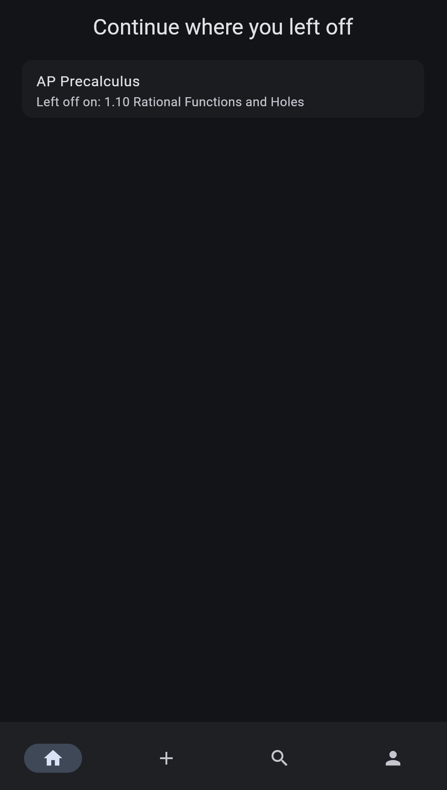
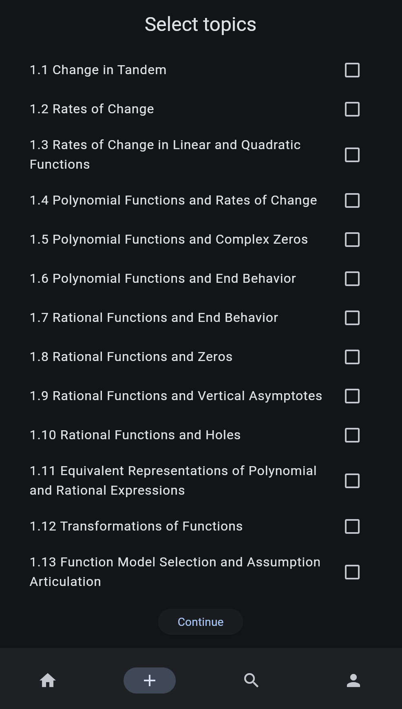
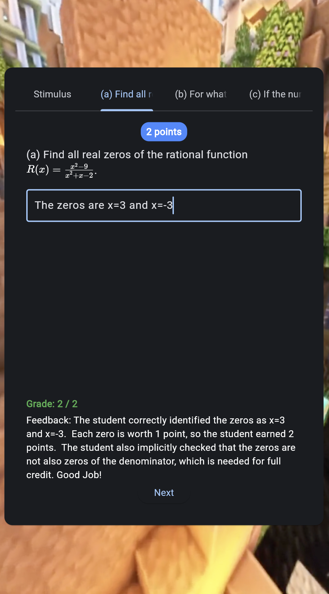
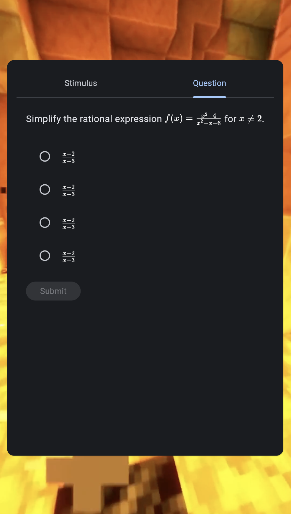

# TrigTok

> [!NOTE]  
> TrigTok has been released! Access it at this link: https://app.trigtok.com

TrigTok is an app that is designed to help students practice AP-style content in a scrolling format, similar to TikTok. You get a feed of explanations, multiple-choice questions, and free-response questions. In addition, Free Response Questions include AI-powered grading and explanations.

## Features
Currently, TrigTok is released under a limited subset of topics and features. In the future, more AP topics will be supported, and custom notes will also be supported.

- **Explanations**: Short, concise explanations of AP topics, designed to be read in under a minute.
- **Multiple Choice Questions**: AP-style multiple-choice questions with explanations.
- **Free Response Questions**: AP-style free-response questions with AI-powered grading and explanations.

Some screenshots!
<table>
    <tr>
        <td>
            
            
Home page

        </td>
        <td>
            
            
New Session Page

        </td>
    </tr>
    <tr>
        <td>
            
            
Free Response Prompt

        </td>
        <td>
            
            
Multiple Choice Question

        </td>
    </tr>
</table>

To get started, go to https://app.trigtok.com and create an account! Have fun studying!
